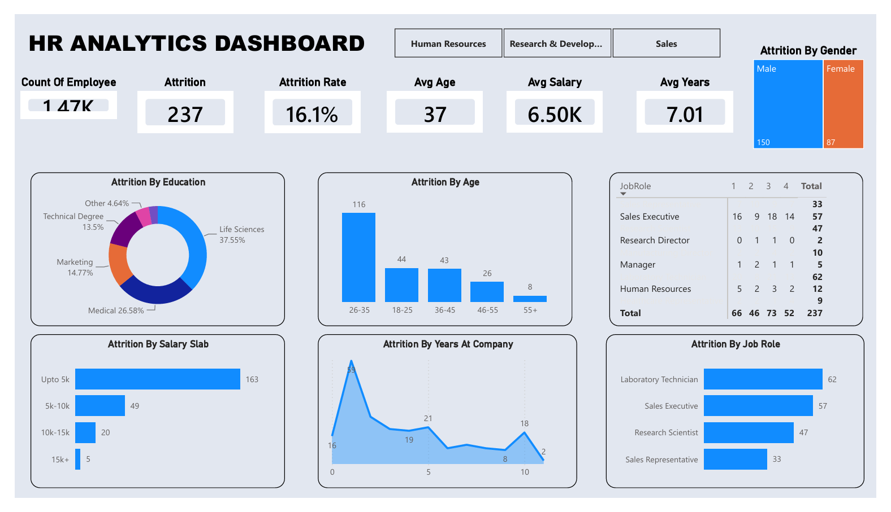

# 📊 HR Analytics Dashboard

An interactive and premium Power BI dashboard designed to analyze employee attrition, workforce demographics, and organizational insights. This project helps HR departments identify key drivers behind attrition and make data-driven decisions to improve employee retention.

---

## 🚀 Live Preview & Look

---

## 💡 Key Insights & Findings
* **Attrition Rate:** The overall attrition rate stands at **19.0%** with a total of **12 departures** from the current filtered cohort.
* **Demographics:** The highest attrition is observed in the **26-35 age group**, indicating a need for better engagement strategies for early-to-mid career professionals.
* **Department Insights:** Focuses heavily on analyzing trends across **Human Resources, Research & Development, and Sales**.
* **Work-Life & Salary:** Tracks correlation between employee attrition and salary slabs/years at the company to highlight compensation gaps.

---

## 🛠️ Tech Stack & Features
* **Tool:** Power BI Desktop
* **Data Transformation:** Power Query for data cleaning, type profiling, and structural formatting.
* **Data Modeling:** Created cohesive relationships and calculated key metrics using custom **DAX Measures** (Attrition Rate, Average Age, Average Salary).
* **UI/UX Design:** Implemented a modern, clean light-themed UI with balanced typography and structural transparency for superior readability.

---

## 📂 How to Use
1. Clone this repository or download the `.pbix` file.
2. Open `HR_Analytics_Dashboard.pbix` using **Power BI Desktop**.
3. Use the top interactive slicers to filter data dynamically by Department (Human Resources, R&D, Sales).