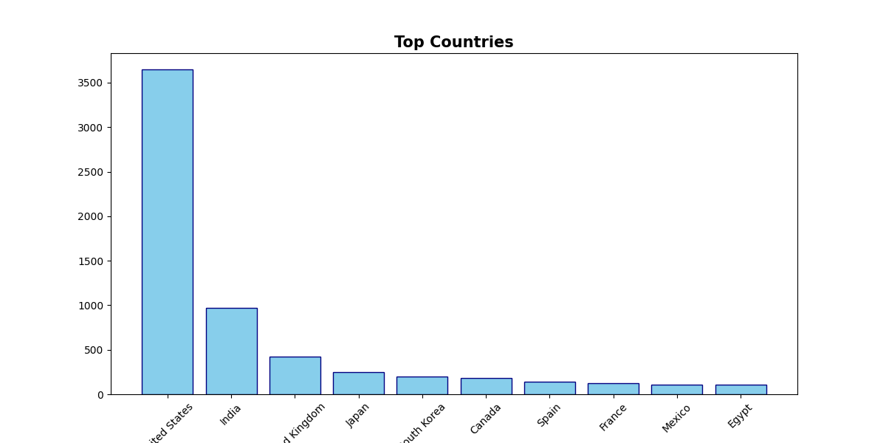
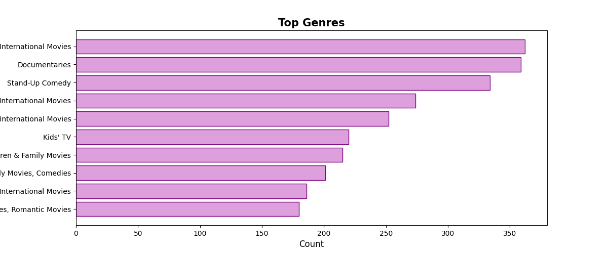
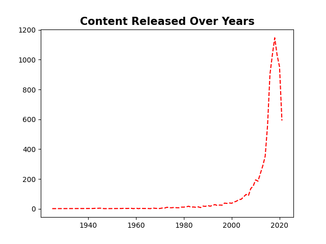
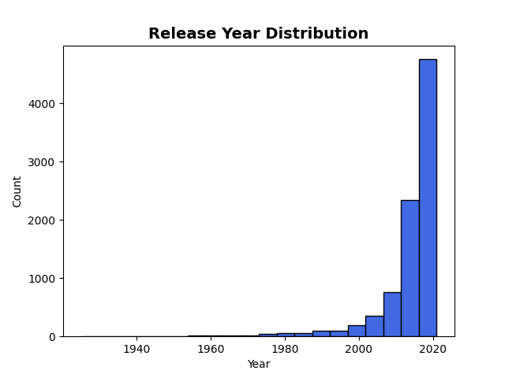
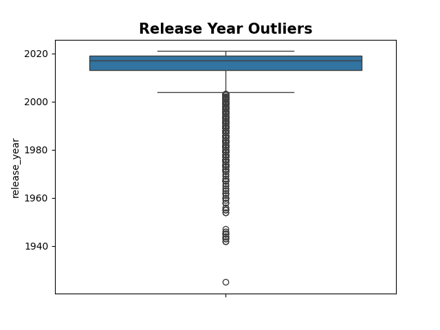

# 🎬 Netflix Data Analysis

## 📌 Project Overview
This project focuses on performing Exploratory Data Analysis (EDA) on the Netflix Movies and TV Shows dataset using Python.

The objective of this project is to analyze Netflix content trends, clean the dataset, handle missing values, detect outliers, and create meaningful visualizations.

---

# 🛠️ Tools & Libraries Used
- Python
- Pandas
- Matplotlib
- Seaborn

---

# 📂 Project Structure

Netflix-Data-Analysis/
│
├── netflix_analysis.ipynb
├── netflix_titles.csv
├── README.md
└── images/
    ├── type_chart.png
    ├── country_chart.png
    ├── genre_chart.png
    ├── year_trend.png
    ├── release_distribution.png
    ├── release_outliers.png
    └── missing_values_heatmap.png

---

# 📊 Analysis Performed

## ✅ Data Cleaning
- Checked missing values
- Handled categorical missing values
- Removed duplicate records

## 📈 Exploratory Data Analysis
- Movies vs TV Shows comparison
- Top producing countries
- Most popular genres
- Content release trends over years
- Release year distribution analysis

## 📦 Outlier Detection
- Detected outliers using boxplot visualization
- Retained valid historical release years for accurate analysis

---

# 📷 Visualizations

## Movies vs TV Shows

---

## Top Countries

---

## Top Genres

---

## Content Trend by Year

---

## Release Year Distribution

---

## Outlier Detection

---

# 🔍 Key Insights
- Movies are more common than TV Shows on Netflix
- Content production increased rapidly after 2015
- USA contributes the highest amount of content
- Drama and Comedy are among the most popular genres
- Missing values were successfully handled during preprocessing
- Historical release years created visible outliers in the dataset

---

# 🚀 Future Improvements
- Interactive dashboard creation
- Recommendation system integration
- Advanced visualization using Plotly

---

# 👨‍💻 Author
Gaurav Singh